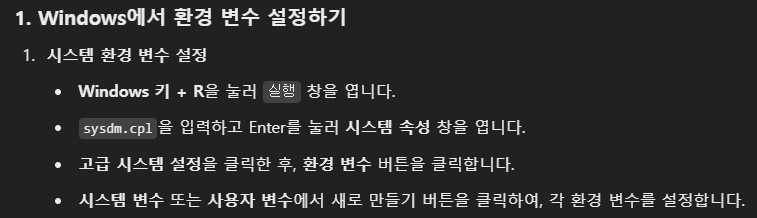

# FastAPI
TermCompass AI모델 처리

## 0. 디렉토리 구조
```
─TermCompass_FastAPI
   ├─admin
   │  └─api_key
   ├─test
   ├─module
   └─task
```

## 1. 검토
입력
```
{"content":"text 혹은 파일"}
```
출력
```
{"result":["검토 결과1","검토 결과2","검토 결과3"...]}
or
{"result":"파일을 읽을 수 없습니다."} # 파일 읽기 실패시
```

## 2. 생성
입력
```
{"content":"사용자 요청 내용"}
```
출력
```
{"result":10001} # 표준 약관 문서 ID
```

## 3. 수정
입력
```
{
    "request":"사용자 요청 내용",
    "current":"현재 작성된 약관",
    "context","현재 컨텍스트"
}
```
출력
```
{
    "result": {
        "answer": "[변경 List]", 
        "context": "업데이트된 context"
    }
}
```

## 4. 채팅
입력
```
{
    "request":"사용자 요청 내용",
    "context","현재 컨텍스트"
}
```
출력
```
{
    "result": {
        "answer": "답변", 
        "context": "업데이트된 context"
    }
}
```
---

## 환경 변수 설정


```python
# 설정할 환경 변수 목록
# MySQL
MYSQL_USERNAME 
MYSQL_PASSWORD 
MYSQL_HOST
MYSQL_PORT
MYSQL_DBNAME

# 국가법령정보 공동활용 (https://open.law.go.kr/LSO/openApi/guideList.do#)
LAW_OPEN_DATA_APIKEY 

# OpenAI 
OPENAI_API_KEY 
```

---
## 가상환경 생성 및 설치
```python
conda create --name FastAPI python=3.12.8

conda activate FastAPI

pip install -r requirements.txt
```
## 도커 배포 (로컬)
```python
# build
docker buildx build --platform linux/amd64 -t [도커 계정]/fastapi:latest --load .

# rum
docker run -d -p 8000:8000 --name fastapi_container [도커 계정]/fastapi:latest

```

## 도커 배포 (클라우드)
``` python
# hub push
docker push [도커 계정]/fastapi:latest
```
